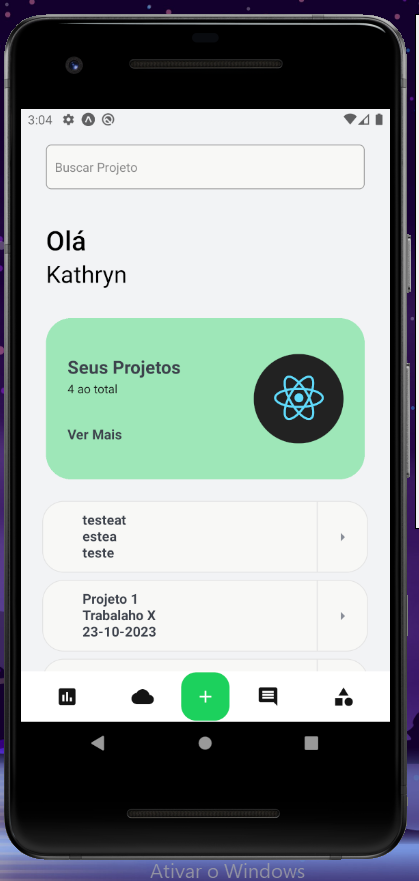
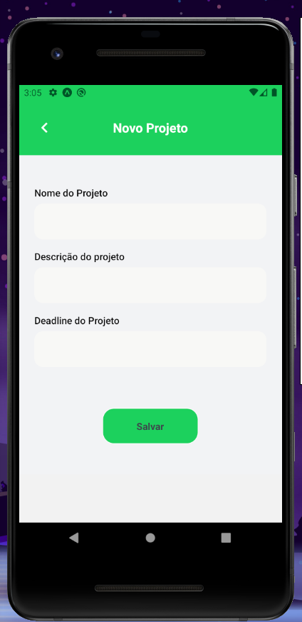
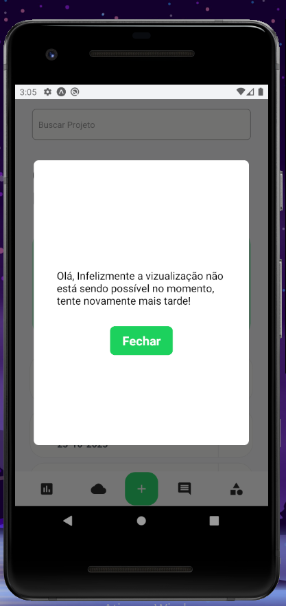

<h1 align="center"> Noweb Challenge </h1>

  
  
  

## Detalhes Importantes:

- 1) Aplicativo foi desenvolvido com emulador Android;
- 2) O formulário do Figma, não consegui fazer, são competencias que ainda não desenvolvi,
     mas espero ter a oportunidade de desenvolver;
- 3) Todo o projetos conta com ações dinâmicas e Storage interno;
- 4) Obrigado pela oportunidade, com certeza aprendi muito tentando construir o projeto;

## 🚀 Tecnologias

Esse projeto foi desenvolvido com as seguintes tecnologias:

- React Native
  - React Native Async Storage
  - React Native Navigation
  - react-native-uuid
  - react-native-iphone-x-helper
- TypeScritp
- Git e Github
